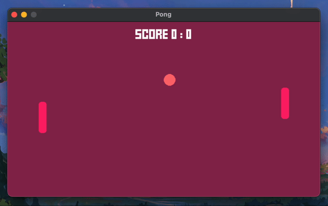

# SDL2 Pong

> A basic pong clone created using SDL2.

    

<!-- TODO: provide web build link -->
<!-- [Play in a web browser!]() -->

This was an exercise to learn C++ and SDL2, specifically focused on memory management via the usage of `std::shared_ptr` and general code structure/architecture.

## Libraries

- [SDL](https://github.com/libsdl-org/SDL) - Cross-platform library for windowing, graphics, input, audio 
- [SDL_image](https://github.com/libsdl-org/SDL_image) - Image loader library for SDL
- [SDL_ttf](https://github.com/libsdl-org/SDL_ttf) - Font loader + renderer library for SDL
- [SDL_mixer](https://github.com/libsdl-org/SDL_mixer) - Simple multi-channel audio mixer for SDL

## Compiling

### Requirements

- C++ Compiler (Tested with LLVM's [Clang](https://clang.llvm.org/) v13.1.6 using `-std=c++17`)
- [CMake](https://cmake.org/) - Cross-platform build environment setup

### Building

1. `git clone --recursive https://github.com/eilume/sdl-pong`
2. `cd sdl-pong`
3. `make setup-[debug|release|dist|all]`
4. `make build-[debug|release|dist|web]`
5. `make run-[debug|release|dist]`